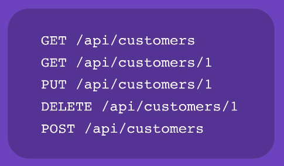
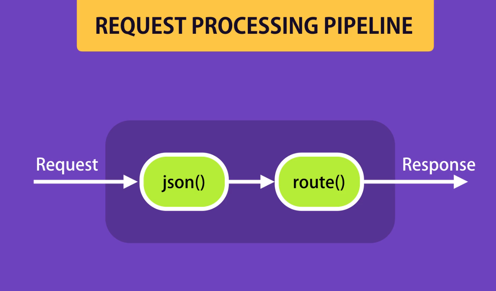
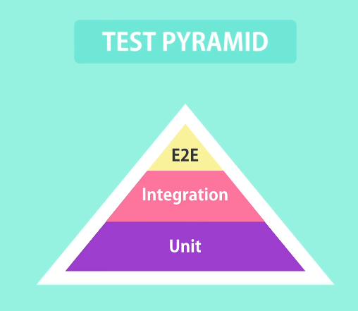

## Global Object

Object or function that available everywhere

we things like this in window

- log
- setTimeout()
- clearTimeout()
- setInterval()
- clearInterval()

in node we have globalThis

## Module

for stop rewriting do not put functions in global scope

every project has main file for all modules

> in node every file is a module

## Module Wrapper Function

In Node.js, the **Module Wrapper Function** is an automatic function that wraps every module's code before execution. It provides module-scoped variables like `exports`, `require`, `module`, `__filename`, and `__dirname`, ensuring that top-level variables remain private to that module. This wrapper also prevents polluting the global scope and allows Node to manage module loading and caching effectively.

## Path Module

```js
const path = require("path");

var pathObj = path.parse(__filename);
console.log(pathObj);
```

## OS Module

```js
const os = require("os");

var totalMemory = os.totalmem();
var freeMemory = os.freemem();

console.log(`Total Memory: ${totalMemory}`);
console.log(`Free Memory: ${freeMemory}`);
```

## File System Module

```js
const fs = require("fs");

const files = fs.readdirSync("./");
console.log(files);

fs.readdir("$", function (err, files) {
  if (err) console.log("Error", err);
  else console.log("Result", files);
});
```

## EVENT

A signal that something has happened

```js
const EventEmitter = require("events");

const Logger = require("../logger");
const logger = new Logger();

// Register a listener
logger.on("messageLogged", (arg) => {
  console.log("Listener called", arg);
});

logger.log("message");
```

```js
const EventEmitter = require("events");

var url = "https://mylogger.io/log";

class Logger extends EventEmitter {
  log(message) {
    // Send an HTTP request
    console.log(message);

    // Raise an event
    this.emit("messageLogged", { id: 1, url: "http://" });
  }
}

module.exports = Logger;
```

## HTTP Module

```js
const http = require("http");

const server = http.createServer((req, res) => {
  if (req.url === "/") {
    res.write("Hello world");
    res.end();
  }

  if (req.url === "/api/courses") {
    res.write(JSON.stringify([1, 2, 3]));
    res.end();
  }
});

server.listen(3000);

console.log("Listening on port 3000...");
```

## Semantic Versioning

Major.Minor.Patch

Patch : fixing bug
Minor : add new feature that don't break working API
Major : that breaking changes

^ : Continue but keep Major 4.x
~ : Keep same Major and Minor 1.8.x
: No changes if somebody else install your project

## Listing the Install Packages

you see by running npm list --depth=1 or any number to go deeper

## Viewing Registry Info

we can see more info about the packages we install like this

```
npm view mongoose dependencies
npm view mongoose versions
```

## RESTfull Services

REST is stand for Representational State Transfer

CRUD Operations are

- Create
- Read
- Update
- Delete

HTTP Methods

- GET
- POST
- PUT
- DELETE



## Middleware

something between request nad response and do some operation there



## Pattern for async code

```js
console.log("Before");
const user = getUser(1);
console.log(user);
console.log("After");

function getUser(id) {
  setTimeout(() => {
    console.log("Reading user from database");
    return {
      id: id,
      gitHubUsername: "mosh",
    };
  }, 2000);
}
```

like this code we get undefined for the value of the user and we have to wait until the value is arrived for that we have these 3 patterns

- Callback
- Promise
- async/await

### Callback

```js
console.log("Before");
const user = getUser(1, (user) => {
  console.log("User", user);

  getRepositories(user.gitHubUsername, (repos) => {
    console.log("Repos", repos);
  });
});
console.log("After");

function getUser(id, callback) {
  setTimeout(() => {
    console.log("Reading user from database");
    callback({
      id: id,
      gitHubUsername: "mosh",
    });
  }, 2000);
}

function getRepositories(username, callback) {
  setTimeout(() => {
    console.log("Calling GitHub API...");
    callback(["rep1", "rep2", "rep3"]);
  }, 2000);
}
```

> But callback comes with problem that is called Callback hell we have deeply instead callbacks

## Named Functions to Rescue

instead of calling anonymous function we use named function but still this is not a good approach

```js
console.log("Before");
const user = getUser(1, getRepositories);

console.log("After");

function getRepositories(user) {
  console.log("User", user);
  getRepositories(user.gitHubUsername, getCommits);
}

function getCommits(repos) {
  console.log("Repos", repos);
  getCommits(repos, displayCommit);
}

function displayCommit(commits) {
  console.log(commits);
}

function getUser(id, callback) {
  setTimeout(() => {
    console.log("Reading user from database");
    callback({
      id: id,
      gitHubUsername: "mosh",
    });
  }, 2000);
}

function getRepositories(username, callback) {
  setTimeout(() => {
    console.log("Calling GitHub API...");
    callback(["rep1", "rep2", "rep3"]);
  }, 2000);
}
```

## Promise

> Hold the eventual result of an asynchronous operation

first we have **pending** state and after async operation it would

- fulfilled
- rejected

```js
const p = new Promise((resolve, reject) => {
  // Kick of some async work

  setTimeout(() => {
    resolve(1);
    reject(new Error("message"));
  }, 2000);
});

p.then((result) => console.log("Result", result)).catch((err) =>
  console.log("Error", err.message),
);
```

## Running Promises in Parallel

```js
const p1 = new Promise((resolve) => {
  setTimeout(() => {
    console.log("Async operation 1...");
    resolve(1);
  }, 2000);
});

const p2 = new Promise((resolve) => {
  setTimeout(() => {
    console.log("Async operation 2...");
    resolve(2);
  }, 2000);
});

Promise.all([p1, p2])
  .then((result) => console.log(result))
  .catch((err) => console.log("Error", err.message));
```

if all fulfil we see but if you want if one of them is success we replace Promise.all with Promise.race

## Schema types

- String
- Number
- Date
- Buffer
- Boolean
- ObjectID
- Array

## Comparison Query Operators

- **eq** : equal
- **ne** : not equal
- **gt** : greater than
- **gte** : greater than or equal to
- **lt** : less than
- **lte** : less than or equal to
- **in**
- **nin** : not in

```js
async function getCourses() {
  const courses = await Course.find({ price: { $gte: 10, $lte: 20 } })
    .limit(10)
    .sort({ name: 1 })
    .select({ name: 1, tags: 1 });
  console.log(courses);
}

getCourses();
```

this another example

```js
async function getCourses() {
  const courses = await Course.find({ price: { $in: [10, 15, 20] } })
    .limit(10)
    .sort({ name: 1 })
    .select({ name: 1, tags: 1 });
  console.log(courses);
}

getCourses();
```

## Logical Query Operators

- or
- and

```js
async function getCourses() {
  const courses = await Course.find()
    .or([{ author: "Mosh" }, { isPublished: true }])
    .limit(10)
    .sort({ name: 1 })
    .select({ name: 1, tags: 1 });
  console.log(courses);
}
```

## Regular Expressions

```js
async function getCourses() {
  const courses = await Course
    // Starts with Mosh
    .find({ author: /^Mosh/i })

    // Ends with Hamedani
    .find({ author: /Hamedani$/i })

    // Contains Mosh
    .find({ author: /.*Mosh.*/i })

    .limit(10)
    .sort({ name: 1 })
    .select({ name: 1, tags: 1 });
  console.log(courses);
}
```

## Count

to show the amount of element that match the criteria

```js
async function getCourses() {
  const courses = await Course.find({
    author: "Mosh",
    isPublished: true,
  })
    .limit(10)
    .sort({ name: 1 })
    .count();
  console.log(courses);
}
```

## Pagination

```js
async function getCourses() {
  const pageNumber = 2;
  const pageSize = 10;

  const courses = await Course.find({
    author: "Mosh",
    isPublished: true,
  })
    .skip((pageNumber - 1) * pageSize)
    .limit(pageSize)
    .limit(10)
    .sort({ name: 1 })
    .select({ name: 1, tags: 1 });
  console.log(courses);
}
```

## Modeling Relationships

we have three types of data base

### Reference (Normalization )

in this type of database our data is consistency but our query performance is slow

```js
let author = {
  authorID : 1
  name : 'Mosh'
}

let course = {
  author = authorID
}
```

## Embedded Documents (Denormalization)

in this type of data our data is really fast by query but it can be inconstant tomorrow if we change author name it might not change in some places

```js
let course = {
  author: {
    name: "Mosh",
  },
};
```

## Hybrid

```js
let author = {
  name: "mosh",
  // 50 other properties
};

let course = {
  author: {
    id: "ref",
    name: "mosh",
  },
};
```

## ObjectID

we have id like this for example 5a724953ab83547957541e6e

in total is 12 bytes

- 4 bytes : timestamp
- 3 bytes : machine identifier
- 2 bytes : process identifier
- 3 bytes : counter

this is an example of getting id the chance getting one id twice is if user at same time at same machine and same process and generate more than 16 million we see duplication

## What is automated testing

The practice of writing code to test our code, and then run those tests in an automated fashion.

## Benefits of automated testing

- Test your code frequently , in less time
- Catch bugs before deploying
- Deploy with confidence
- Refactor with confidence
- Focus more on the quality

> **Refactoring** means changing the structure of the code without changing its behavior.

## Types of test

- Unite
  - Tests a unite of an application without **external dependencies**
    - cheap to write
    - Execute fast
    - Don't give a lot of confidence
- Integration
  - Tests the application with its **external dependencies**
    - Take longer to execute
    - Give more confidence
- E2E (End-to-End)
  - Drives an application through its UI.
    - Give you the greatest confidence
    - Very slow
    - Very brittle
     
## Test Pyramid



> The actual ratio between unit, integration and end-to-end tests depends on your project.

- Favour unit tests to e2e tests.
- Cover unit test gaps with integration tests.
- Use end-to-end tests sparingly.

## Tooling

- Jasmine
- Mocha
  - Chai
  - Sinon
- Jest
 
> Focus on the **fundamentals** not the tooling